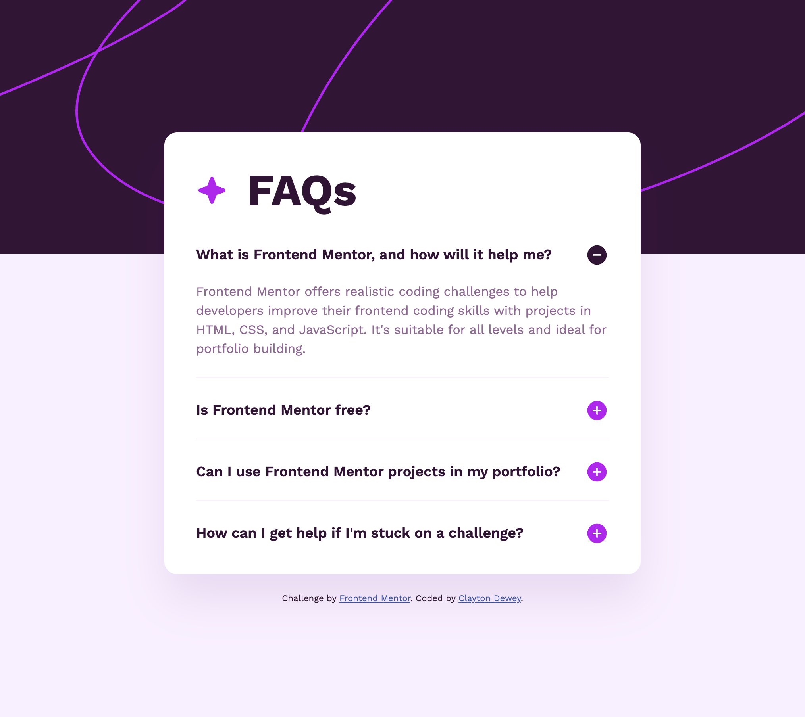

# Frontend Mentor - FAQ accordion solution

This is a solution to the [FAQ accordion challenge on Frontend Mentor](https://www.frontendmentor.io/challenges/faq-accordion-wyfFdeBwBz). Frontend Mentor challenges help you improve your coding skills by building realistic projects.

## Table of contents

- [Overview](#overview)
  - [The challenge](#the-challenge)
  - [Screenshot](#screenshot)
  - [Links](#links)
- [My process](#my-process)
  - [Built with](#built-with)
  - [What I learned](#what-i-learned)
  - [Continued development](#continued-development)
  - [Useful resources](#useful-resources)
- [Author](#author)

**Note: Delete this note and update the table of contents based on what sections you keep.**

## Overview

### The challenge

Users should be able to:

- Hide/Show the answer to a question when the question is clicked
- Navigate the questions and hide/show answers using keyboard navigation alone
- View the optimal layout for the interface depending on their device's screen size
- See hover and focus states for all interactive elements on the page

### Screenshot

### Links

- Solution URL: [github.com/ClaytonDewey/fem-accordion](https://github.com/ClaytonDewey/fem-accordion)
- Live Site URL: [claytondewey.github.io/fem-accordion](https://claytondewey.github.io/fem-accordion/)

## My process

### Built with

- Accessibility
- Semantic HTML5 markup
- CSS custom properties
- Flexbox
- Mobile-first workflow

### What I learned

I've always tried to focus on accessibility, and I learned a bit more this time around.

### Continued development

- Sass
- CSS custom variables
- JavaScript
- Accessibility

### Useful resources

- [W3C Authoring Practices Guide(APG)](https://www.w3.org/WAI/ARIA/apg/patterns/accordion/examples/accordion/) - I referred to this for making an accessible accordion.

## Author

- Website - [Clayton Dewey](https://www.claytondewey.com)
- Frontend Mentor - [@ClaytonDewey](https://www.frontendmentor.io/profile/ClaytonDewey)
- Twitter - [@ClaytonDewey](https://www.twitter.com/ClaytonDewey)
